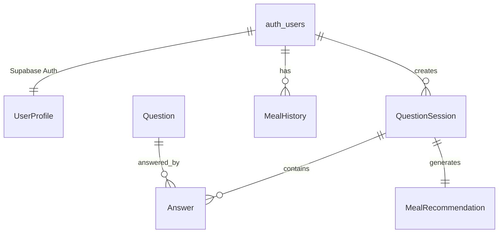

# データモデル: 食事決定アプリ (MealFinder) - Supabase統合

**作成日**: 2025-09-13  
**フェーズ**: Phase 1 - データモデル設計（MVP重視 + Supabase）  
**関連文書**: spec.md, research.md

## エンティティ概要（Supabase PostgreSQL）

Supabase PostgreSQLを使用したMVP実装のエンティティとリレーションを定義する。Row Level Security（RLS）によるセキュリティ、リアルタイム同期を考慮。



**Supabase統合特徴**:
- `auth.users`（Supabase Auth）と `UserProfile`（カスタムテーブル）の分離
- Row Level Security（RLS）による行レベルアクセス制御
- リアルタイム機能: QuestionSession, MealHistory の即座同期
- PostgreSQL機能: JSON型、全文検索、拡張機能活用

**初期フェーズで除外される機能**:
- ActionOption エンティティ（将来フェーズで追加）
- 学習・分析関連の複雑なリレーション（将来フェーズで追加）

## エンティティ詳細

### 1. ユーザー認証（Supabase Auth管理）

Supabase Authが管理する `auth.users` テーブル（直接操作不可）:
```sql
-- auth.users (Supabase管理)
CREATE TABLE auth.users (
  id UUID PRIMARY KEY,
  email TEXT UNIQUE NOT NULL,
  email_verified BOOLEAN DEFAULT false,
  encrypted_password TEXT,
  created_at TIMESTAMPTZ DEFAULT now(),
  updated_at TIMESTAMPTZ DEFAULT now()
);
```

**Supabase Auth機能**:
- メール・パスワード認証
- メール認証（確認リンク送信）
- パスワードリセット
- セッション管理（JWT）
- 将来的にソーシャルログイン追加可能

**TypeScript型定義**:
```typescript
// Supabase Auth User（読み取り専用）
interface AuthUser {
  id: string;
  email?: string;
  email_confirmed_at?: string;
  created_at: string;
  updated_at: string;
}
```

### 2. UserProfile（ユーザープロファイル）- Supabase PostgreSQL

```sql
-- user_profiles テーブル
CREATE TABLE user_profiles (
  id UUID PRIMARY KEY REFERENCES auth.users(id) ON DELETE CASCADE,
  preferred_genres TEXT[] NOT NULL CHECK (array_length(preferred_genres, 1) BETWEEN 1 AND 5),
  allergies TEXT[] DEFAULT '{}',
  spice_preference TEXT NOT NULL CHECK (spice_preference IN ('none', 'mild', 'medium', 'hot', 'very_hot')),
  budget_range TEXT NOT NULL CHECK (budget_range IN ('budget', 'moderate', 'premium', 'luxury')),
  created_at TIMESTAMPTZ DEFAULT now(),
  updated_at TIMESTAMPTZ DEFAULT now()
);

-- RLS (Row Level Security) ポリシー
ALTER TABLE user_profiles ENABLE ROW LEVEL SECURITY;

CREATE POLICY "Users can view own profile" ON user_profiles
  FOR SELECT USING (auth.uid() = id);

CREATE POLICY "Users can update own profile" ON user_profiles
  FOR UPDATE USING (auth.uid() = id);

CREATE POLICY "Users can insert own profile" ON user_profiles
  FOR INSERT WITH CHECK (auth.uid() = id);
```

**TypeScript型定義**:
```typescript
interface UserProfile {
  id: string;                        // auth.users.id FK
  preferred_genres: CuisineGenre[];  // PostgreSQL配列型
  allergies: string[];               // PostgreSQL配列型
  spice_preference: SpiceLevel;      // ENUM制約
  budget_range: BudgetRange;         // ENUM制約
  created_at: string;
  updated_at: string;
}

// 将来フェーズで追加予定の学習データテーブル
interface UserLearningData {
  user_id: string;
  question_accuracy: number;         // DECIMAL(3,2)
  successful_recommendations: number; // INTEGER
  preference_weights: Record<string, number>; // JSONB型
  updated_at: string;
}
```

type CuisineGenre = 
  | 'japanese' | 'chinese' | 'korean' | 'italian' | 'french'
  | 'american' | 'indian' | 'thai' | 'mexican' | 'other';

type SpiceLevel = 'none' | 'mild' | 'medium' | 'hot' | 'very_hot';

type BudgetRange = 'budget' | 'moderate' | 'premium' | 'luxury';
```

**バリデーション**:
- `preferredGenres`: 1-5個の選択
- `spicePreference`: enum値必須
- `budgetRange`: enum値必須
- `questionAccuracy`: 0.0 - 1.0の範囲

### 3. QuestionSession（質問セッション）- Supabase PostgreSQL

```sql
-- question_sessions テーブル
CREATE TABLE question_sessions (
  id UUID PRIMARY KEY DEFAULT gen_random_uuid(),
  user_id UUID NOT NULL REFERENCES auth.users(id) ON DELETE CASCADE,
  started_at TIMESTAMPTZ DEFAULT now(),
  completed_at TIMESTAMPTZ,
  status TEXT NOT NULL CHECK (status IN ('in_progress', 'completed', 'abandoned')) DEFAULT 'in_progress',
  time_of_day TEXT NOT NULL CHECK (time_of_day IN ('breakfast', 'lunch', 'dinner', 'snack')),
  location JSONB, -- {latitude: number, longitude: number, prefecture?: string, city?: string}
  total_questions INTEGER DEFAULT 0 CHECK (total_questions <= 10),
  no_answer_count INTEGER DEFAULT 0 CHECK (no_answer_count <= 5),
  current_question_index INTEGER DEFAULT 0 CHECK (current_question_index <= 9),
  created_at TIMESTAMPTZ DEFAULT now(),
  updated_at TIMESTAMPTZ DEFAULT now()
);

-- RLS ポリシー
ALTER TABLE question_sessions ENABLE ROW LEVEL SECURITY;

CREATE POLICY "Users can manage own sessions" ON question_sessions
  FOR ALL USING (auth.uid() = user_id);

-- リアルタイム有効化
ALTER PUBLICATION supabase_realtime ADD TABLE question_sessions;
```

**TypeScript型定義**:
```typescript
interface QuestionSession {
  id: string;
  user_id: string;
  
  // セッション情報
  startedAt: Date;
  completedAt?: Date;
  status: SessionStatus;
  timeOfDay: TimeSlot;
  location?: Location;
  
  // 質問フロー
  totalQuestions: number;       // 実際に出題された質問数
  noAnswerCount: number;        // "いいえ"の回答数
  currentQuestionIndex: number; // 現在の質問番号（0ベース）
  
  // 結果
  recommendation?: MealRecommendation;
  
  // Relations
  answers: Answer[];
}

type SessionStatus = 'in_progress' | 'completed' | 'abandoned';

type TimeSlot = 'breakfast' | 'lunch' | 'dinner' | 'snack';

interface Location {
  latitude: number;
  longitude: number;
  prefecture?: string;
  city?: string;
}
```

**ビジネスルール**:
- `totalQuestions`: 最大10問
- `noAnswerCount`: 最大5回
- `currentQuestionIndex`: 0-9の範囲
- セッション完了条件: 推薦決定 OR 10問終了 OR 5回No到達

### 4. Question（質問）

```typescript
interface Question {
  id: string;                   // UUID
  
  // 質問内容
  text: string;                // 質問文
  category: QuestionCategory;   // カテゴリー
  
  // 条件分岐ロジック
  triggerConditions: TriggerCondition[]; // 出題条件
  followUpLogic: FollowUpLogic;         // 回答後の分岐
  
  // メタデータ
  priority: number;            // 出題優先度（1-10）
  isSystemQuestion: boolean;   // システム生成 vs AI生成
  createdAt: Date;
}

type QuestionCategory = 'mood' | 'genre' | 'cooking' | 'situation' | 'time' | 'preference';

interface TriggerCondition {
  type: 'time_of_day' | 'location' | 'previous_answer' | 'user_preference';
  operator: 'equals' | 'contains' | 'greater_than' | 'less_than';
  value: any;
}

interface FollowUpLogic {
  onYes: FollowUpAction;
  onNo: FollowUpAction;
}

interface FollowUpAction {
  type: 'recommend_meal' | 'ask_specific_question' | 'apply_filter' | 'increase_priority';
  payload: any;
}
```

### 5. Answer（回答）

```typescript
interface Answer {
  id: string;                   // UUID
  sessionId: string;           // QuestionSession.id FK
  questionId: string;          // Question.id FK
  
  // 回答内容
  response: boolean;           // true=はい, false=いいえ
  responseTime: number;        // 回答時間（ミリ秒）
  
  // メタデータ
  questionIndex: number;       // セッション内での質問順序
  answeredAt: Date;
}
```

### 6. MealRecommendation（料理推薦）- 初期フェーズ

```typescript
interface MealRecommendation {
  id: string;                   // UUID
  sessionId: string;           // QuestionSession.id FK
  
  // 推薦内容
  mealName: string;            // 料理名
  description: string;         // 説明
  cuisineGenre: CuisineGenre;  // ジャンル
  
  // 推薦メタデータ
  confidence: number;          // 推薦確信度（0-1）
  reasoningSteps: string[];    // 推薦理由の説明
  
  // ユーザーアクション（初期フェーズは単純化）
  userReaction?: 'liked' | 'disliked' | 'saved';
  
  createdAt: Date;
}

// 将来フェーズで追加予定のアクション機能
interface ActionOption {
  type: 'restaurant_search' | 'recipe_view' | 'delivery_order';
  title: string;
  description: string;
  actionUrl?: string;
  isAvailable: boolean;
}
```

### 7. MealHistory（食事履歴）- Supabase PostgreSQL

```sql
-- meal_history テーブル
CREATE TABLE meal_history (
  id UUID PRIMARY KEY DEFAULT gen_random_uuid(),
  user_id UUID NOT NULL REFERENCES auth.users(id) ON DELETE CASCADE,
  meal_name TEXT NOT NULL,
  cuisine_genre TEXT NOT NULL CHECK (cuisine_genre IN ('japanese', 'chinese', 'korean', 'italian', 'french', 'american', 'indian', 'thai', 'mexican', 'other')),
  consumed_at TIMESTAMPTZ NOT NULL,
  session_id UUID REFERENCES question_sessions(id) ON DELETE SET NULL,
  source TEXT NOT NULL CHECK (source IN ('recommendation', 'manual_entry')) DEFAULT 'recommendation',
  satisfaction INTEGER CHECK (satisfaction BETWEEN 1 AND 5),
  created_at TIMESTAMPTZ DEFAULT now()
);

-- インデックス（検索・分析効率化）
CREATE INDEX meal_history_user_consumed_idx ON meal_history(user_id, consumed_at DESC);
CREATE INDEX meal_history_cuisine_idx ON meal_history(cuisine_genre);
CREATE INDEX meal_history_session_idx ON meal_history(session_id);

-- RLS ポリシー
ALTER TABLE meal_history ENABLE ROW LEVEL SECURITY;

CREATE POLICY "Users can manage own meal history" ON meal_history
  FOR ALL USING (auth.uid() = user_id);

-- リアルタイム有効化
ALTER PUBLICATION supabase_realtime ADD TABLE meal_history;
```

**TypeScript型定義**:
```typescript
interface MealHistory {
  id: string;
  user_id: string;
  meal_name: string;
  cuisine_genre: CuisineGenre;
  consumed_at: string;
  session_id?: string;
  source: 'recommendation' | 'manual_entry';
  satisfaction?: number;
  created_at: string;
}

// 将来フェーズで追加予定の分析ビュー
CREATE VIEW meal_analytics AS
SELECT 
  user_id,
  cuisine_genre,
  COUNT(*) as frequency,
  AVG(satisfaction) as avg_satisfaction,
  EXTRACT(HOUR FROM consumed_at) as hour_of_day,
  EXTRACT(DOW FROM consumed_at) as day_of_week
FROM meal_history 
WHERE satisfaction IS NOT NULL
GROUP BY user_id, cuisine_genre, EXTRACT(HOUR FROM consumed_at), EXTRACT(DOW FROM consumed_at);
```

## データ整合性制約

### 参照整合性（Supabase PostgreSQL）
```sql
-- 外部キー制約
ALTER TABLE user_profiles 
  ADD CONSTRAINT fk_user_profiles_auth_users 
  FOREIGN KEY (id) REFERENCES auth.users(id) ON DELETE CASCADE;

ALTER TABLE question_sessions 
  ADD CONSTRAINT fk_question_sessions_auth_users 
  FOREIGN KEY (user_id) REFERENCES auth.users(id) ON DELETE CASCADE;

ALTER TABLE answers 
  ADD CONSTRAINT fk_answers_question_sessions 
  FOREIGN KEY (session_id) REFERENCES question_sessions(id) ON DELETE CASCADE,
  ADD CONSTRAINT fk_answers_questions 
  FOREIGN KEY (question_id) REFERENCES questions(id) ON DELETE CASCADE;

ALTER TABLE meal_recommendations 
  ADD CONSTRAINT fk_meal_recommendations_question_sessions 
  FOREIGN KEY (session_id) REFERENCES question_sessions(id) ON DELETE CASCADE;

ALTER TABLE meal_history 
  ADD CONSTRAINT fk_meal_history_auth_users 
  FOREIGN KEY (user_id) REFERENCES auth.users(id) ON DELETE CASCADE,
  ADD CONSTRAINT fk_meal_history_question_sessions 
  FOREIGN KEY (session_id) REFERENCES question_sessions(id) ON DELETE SET NULL;
```

**Supabase特有の制約**:
- CASCADE DELETE: ユーザー削除時に関連データも削除
- RLS (Row Level Security): auth.uid()による自動アクセス制御
- リアルタイム制約: publication設定による同期範囲制限

### ビジネス制約
1. **Question Session制約**:
   - `totalQuestions` ≤ 10
   - `noAnswerCount` ≤ 5
   - `currentQuestionIndex` < `totalQuestions`

2. **Answer制約**:
   - `questionIndex` は連続した数値
   - 同一 `sessionId` + `questionIndex` は一意

3. **Recommendation制約**:
   - `confidence` ∈ [0.0, 1.0]
   - セッション完了時に1つのみ作成

4. **History重複防止**:
   - 同一 `userId` + `mealName` + `consumedAt`（日付）は重複を警告

## インデックス戦略

### Primary Indexes
- 各エンティティ: `id` (Clustered)

### Secondary Indexes
- `User`: `authId` (Unique), `email` (Unique)
- `QuestionSession`: `userId`, `status`, `startedAt`
- `Answer`: `sessionId`, `questionId`
- `MealRecommendation`: `sessionId`
- `MealHistory`: `userId`, `consumedAt`, `sessionId`

### Composite Indexes
- `QuestionSession`: (`userId`, `status`, `startedAt`)
- `Answer`: (`sessionId`, `questionIndex`)
- `MealHistory`: (`userId`, `consumedAt`)

## データ保存方式

### フロントエンド（LocalStorage + IndexedDB）
```typescript
// LocalStorage（軽量設定）
interface LocalSettings {
  userId: string;
  theme: 'light' | 'dark';
  language: 'ja' | 'en';
  lastSyncAt: Date;
}

// IndexedDB（構造化データ）
interface OfflineStore {
  users: User[];
  profiles: UserProfile[];
  sessions: QuestionSession[];
  answers: Answer[];
  history: MealHistory[];
  questions: Question[]; // オフライン用の基本質問セット
}
```

### 同期戦略
1. **Write-Through**: オンライン時は即座に外部同期
2. **Write-Behind**: オフライン時はローカル保存 → 復旧時バッチ同期
3. **Conflict Resolution**: タイムスタンプベースの Last-Write-Wins

## プライバシー・セキュリティ

### PII（個人識別情報）
- `User.email`: 暗号化保存
- `Location`: 市区町村レベルまでの精度制限
- `UserProfile.allergies`: ハッシュ化保存

### データ保持期間
- `QuestionSession`: 2年間
- `MealHistory`: 1年間
- `Answer`: セッション削除と連動
- `User/UserProfile`: アカウント削除時即座に削除

### GDPR対応
- データポータビリティ: JSON export機能
- 削除権: 完全削除 + 関連データのcascade削除
- アクセス権: ユーザーデータの閲覧・ダウンロード機能